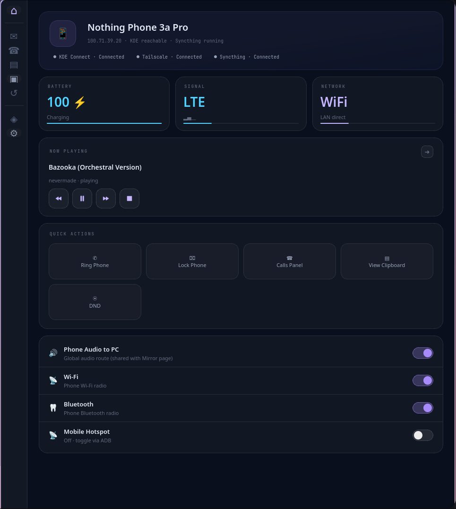
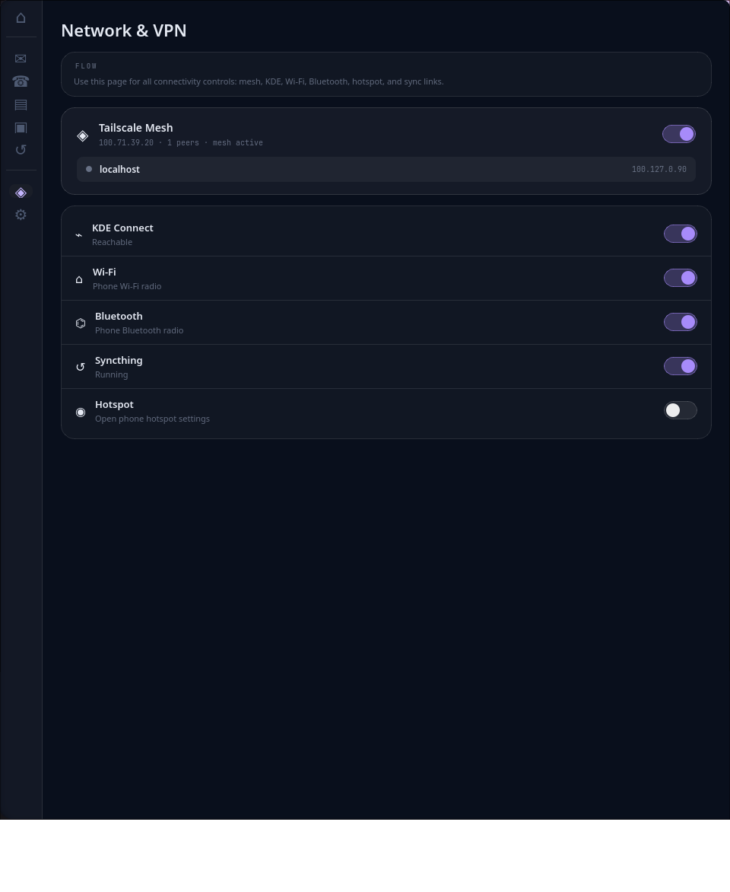
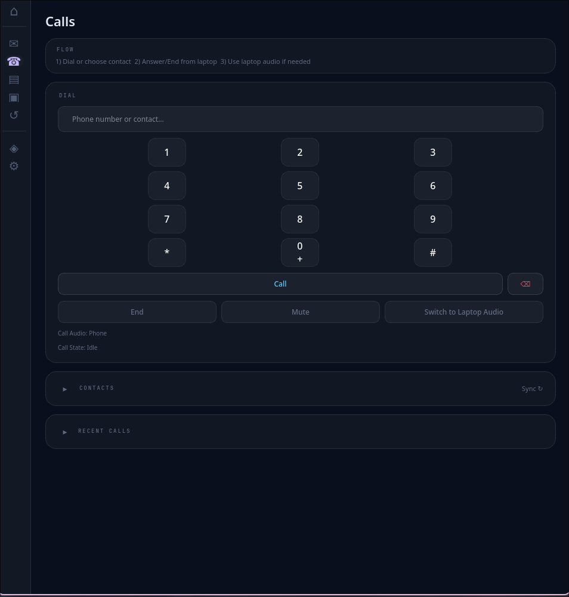
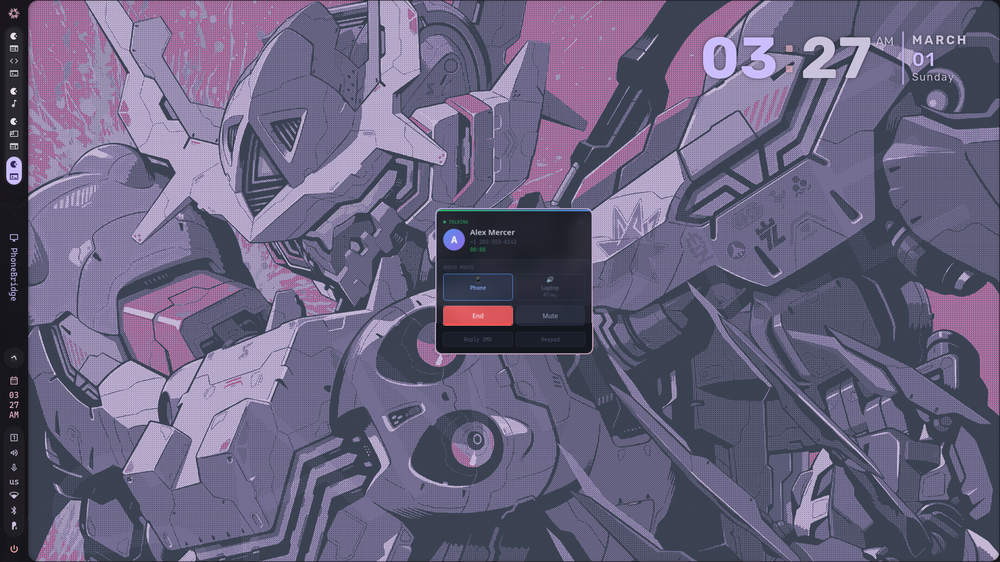
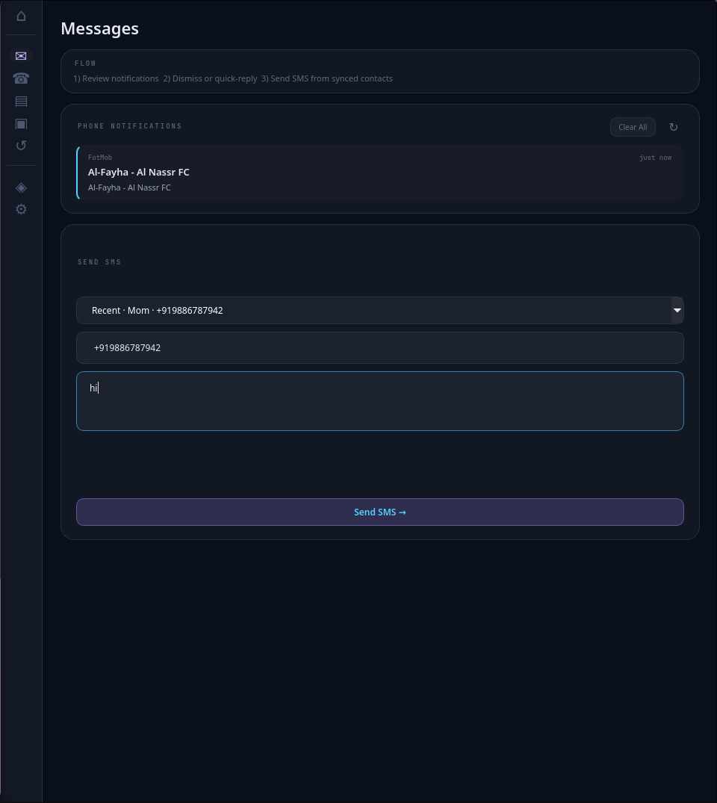
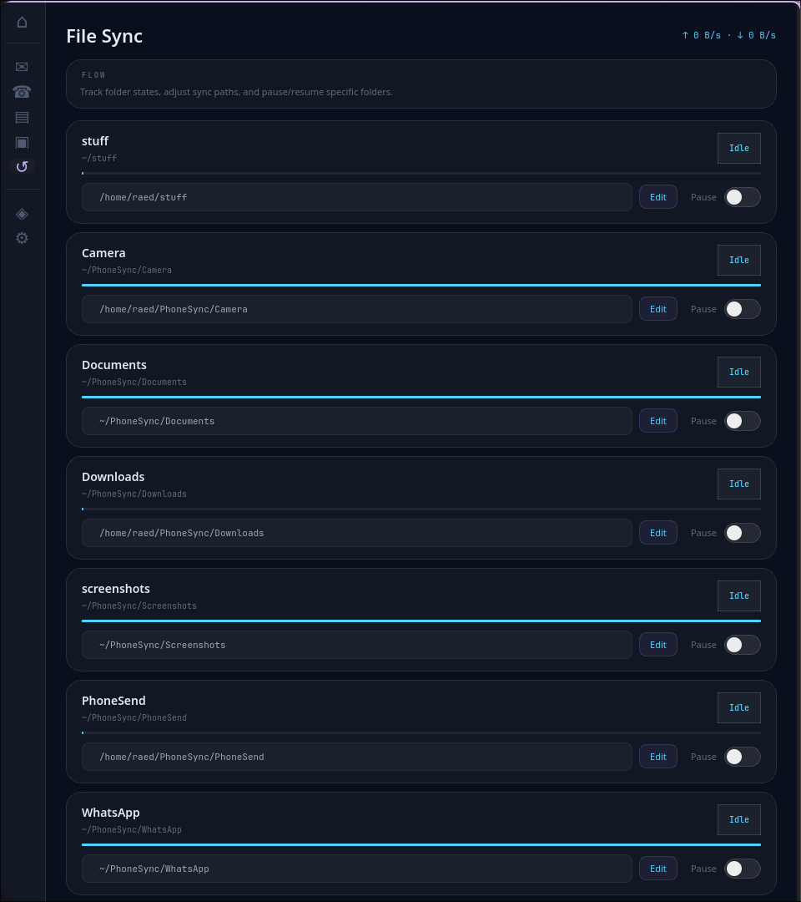
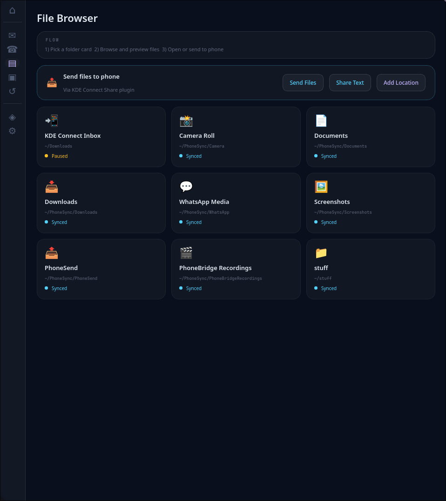
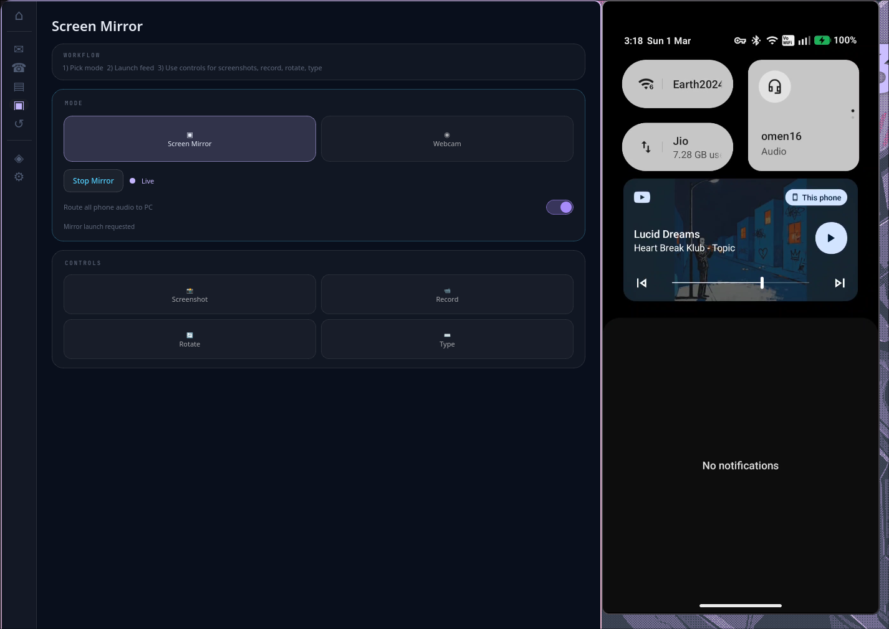
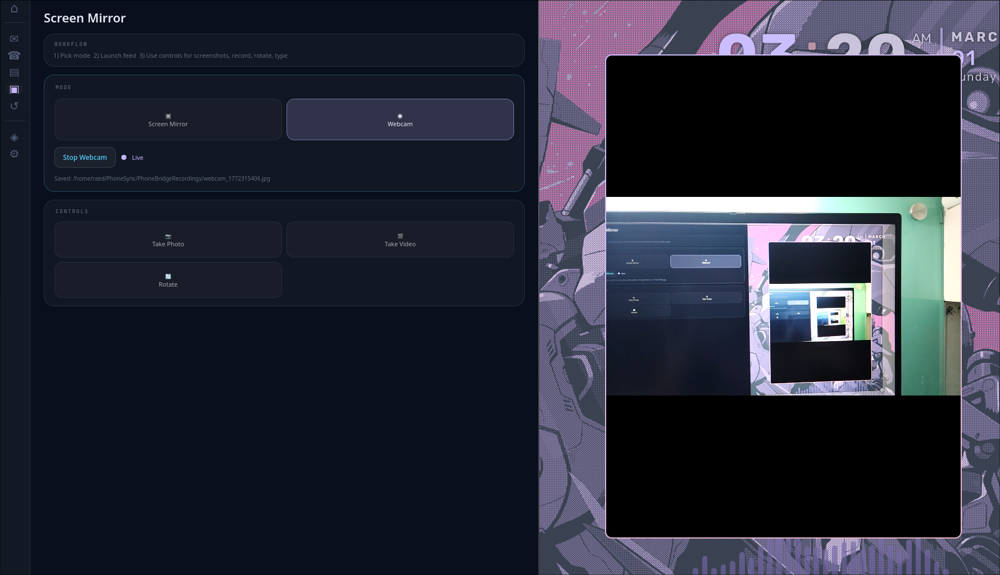
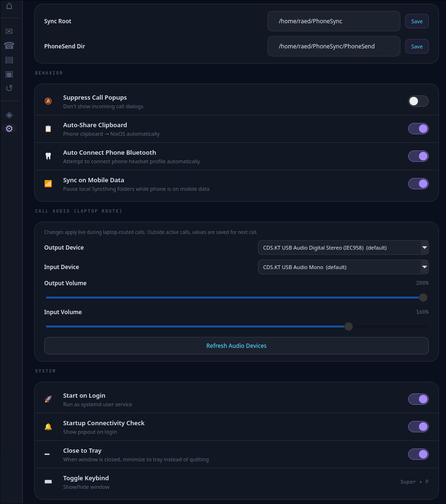

# PhoneBridge

PhoneBridge is a unified desktop control plane for managing a phone from Linux.  
It centralizes the tools you already use—KDE Connect, ADB/scrcpy, Syncthing and Tailscale—into a single Qt6 interface.

You can answer and place calls through your laptop, control media playback, sync files, mirror your phone’s screen, view notifications and even toggle radios without juggling multiple applications.

<p align="center">
  
</p>

---

## ⚠️ Personal Project Notice

PhoneBridge is maintained primarily for my own setup:

- **Phone:** Nothing Phone 3a Pro  
- **Laptop:** Ryzen 7 / RTX 4060  
- **OS:** NixOS  
- **WM:** Hyprland  

I’m sharing the code publicly, but I do **not** guarantee it will work out-of-the-box on every distribution, desktop environment or hardware.

Contributions are welcome.  
Maintenance is best-effort.

---

# Core Capabilities

---

## 🌐 Connectivity Control

- **Tailscale mesh & Syncthing lifecycle**  
  Start/stop Tailscale and Syncthing from the dashboard and view their current status.

- **Bluetooth and Wi-Fi toggles**  
  Toggle Bluetooth or Wi-Fi on the phone via ADB commands with post-state verification.

- **Connectivity health checks**  
  The app polls network state and displays busy flags to prevent conflicting toggles.

<p align="center">
  
</p>

---

## 📞 Calls & Audio Routing

- **Place calls from your PC**  
  Dial contacts or numbers directly; phone audio routes through the laptop and you can switch between phone and laptop mid-call.

- **Incoming call pop-ups**  
  Notifications show caller details with options to answer, deny with SMS or route audio to the laptop.

- **Call audio routing modes**  
  Explicit modes let you:
  - Keep calls on the phone  
  - Switch them to the laptop (using laptop mic + speakers)  
  - Switch back to phone  

- **Device & volume selection**  
  Choose default input/output devices for calls and adjust their volumes from the settings page.

<p align="center">
  
</p>
<p align="center">
  
</p>

---

## 🎵 Media Control & Clipboard

- **Now Playing panel**  
  View current media sessions and control playback.  
  If multiple players are active, choose which one to control.

- **Now Playing artwork behavior**
  - Attempts to resolve album/video art from Android media metadata (URI/path)
  - If artwork is not exposed by the source app, shows a rounded squircle placeholder tile
  - Session switcher keeps per-session artwork resolved where available

- **Clipboard sharing**  
  Sync phone clipboard events to desktop, with optional auto-share and history sanitization.

---

## 📩 Messages & Notifications

- **Notification mirror**  
  View live phone notifications on your desktop with swipe-to-dismiss and two-way sync.

- **SMS compose**  
  Send text messages from your laptop by selecting a contact or entering a number.

- **Notification actions**  
  Supported notifications expose reply/action buttons forwarded to the phone app.

<p align="center">
  
</p>

---

## 📂 File Sync & Transfer

- **Syncthing status & control**  
  Monitor sync progress for each folder, pause/resume transfers and change local storage paths.
  Runtime status is service/API-split aware:
  - Service active + API reachable = connected
  - Service inactive + API reachable (external/manual Syncthing) = connected with external-instance note
  - Recoverable inactive states trigger throttled auto-start attempts.

- **File transfer**  
  Send files from your laptop to your phone via KDE Connect and add new folders for automatic syncing.

- **Folder management**  
  View all synced folders (default and custom), toggle sync on/off and browse them within the app.

- **Thumbnail previews with fallback pipeline**  
  Video thumbnails use `ffmpegthumbnailer` when available, then `ffmpeg`, with cache self-heal if a stale/broken preview is detected.

<p align="center">
  
</p>
<p align="center">
  
</p>

---

## 📱 Device Controls & Mirroring

- **Ring, lock and DND**  
  Quickly ring or lock your phone, toggle Do-Not-Disturb, and control Wi-Fi, Bluetooth and hotspot.  
  (Hotspot toggle uses ADB smart path: USB tether when wired, otherwise hotspot flow.)

- **Screen mirror and webcam mode**  
  - Mirror phone screen  
  - Use phone as webcam  
  - Take screenshots  
  - Record screen  
  - Rotate image  
  - Type into phone from laptop  

- **Bluetooth autoconnect**  
  Automatically connect phone via Bluetooth at startup (optional).

<p align="center">
  
</p>
<p align="center">
  
</p>

---

## ⚙️ System Integration & Settings

- **Autostart on login**  
  Enable a user-level systemd service to launch PhoneBridge at login.  
  Disable from settings.

- **Hyprland keybind**  
  Toggle the PhoneBridge panel with a managed Hyprland bind (`SUPER+P`) when opt-in is enabled.
  The keybind path uses a fast local IPC relay script (`scripts/phonebridge-toggle.sh`) so toggling does not spawn a full runtime sandbox on every keypress.

- **Startup integration writes are opt-in (default: off)**
  - Manage App Icon
  - Manage Desktop Entry
  - Manage Hyprland `SUPER+P` bind
  - Auto-enable Start on Login

  Fresh installs do not mutate `~/.local/share/*`, `~/.config/hypr/*`, or autostart service state until explicitly enabled in Settings.

- **Self-healing runtime on NixOS**  
  If the app encounters missing `libGL.so.1` or `dbus` modules, it automatically re-execs through `steam-run` to satisfy dependencies.

- **KDE Connect auto-recovery watchdog (optional)**  
  A user-level systemd timer can monitor KDE reachability and auto-wake the phone KDE Connect app when it drops (gated by Tailscale + ADB checks).

- **Appearance and behavior settings**
  - Configure call pop-ups  
  - Clipboard auto-share  
  - Bluetooth auto-connect  
  - Sync over mobile data  
  - Call audio devices  
  - Volume levels  

<p align="center">
  
</p>

---

# 🛠 Known Limits & Trade-Offs

PhoneBridge is designed around a specific environment (NixOS + Hyprland).

### Per-feature requirements and failure modes

| Feature            | Requires                                                                     | Failure mode                                                                      |
| ------------------ | ---------------------------------------------------------------------------- | --------------------------------------------------------------------------------- |
| Screen mirror      | `scrcpy`, `adb`                                                              | Mirror page shows explicit missing-tool message                                   |
| Call audio routing | `pactl` or `wpctl` + `pw-dump`                                               | Route silently unavailable; startup warns once                                    |
| Video thumbnails   | `ffmpegthumbnailer` or `ffmpeg`                                              | File browser shows icon fallback (no crash)                                       |
| Notification copy  | `wl-copy` (Wayland) or `xclip` (X11)                                         | Copy action silently dropped                                                      |
| Bluetooth toggles  | `bluetoothctl`                                                               | Bluetooth page controls unavailable                                               |
| KDE Connect bridge | D-Bus session + `kdeconnectd`                                                | Reachability shows **Unknown** (not false-positive Reachable)                     |
| Syncthing sync     | Syncthing API reachable (`syncthing` service or external instance) + API key | Dashboard/Sync pages apply service/API split semantics and auto-recovery attempts |
| Tailscale mesh     | `tailscale` CLI                                                              | Mesh status shows offline; toggles disabled                                       |
| Hotspot            | `adb` + Android `cmd wifi start-softap` or `svc wifi`                        | Hotspot toggle falls back between command families                                |
| Startup writes     | All opt-in; disabled by default                                              | Fresh installs do not mutate `~/.config/hypr`, `~/.local/share`, or autostart     |

Additional caveats:

- Bluetooth call routing can be flaky; activation is gated on profile + mic path presence and rolls back if audio is unavailable.
- KDE watchdog recovery opens KDE Connect on the phone foreground; this may briefly surface UI on devices with strict background limits.
- Missing optional tools are reported once in the startup connectivity popup and in logs; they do not cause crashes.

---

# 🚀 Quick Start

### 1. Install Dependencies

Ensure the following are available:

- Python 3
- Qt6 bindings (`PyQt6` or `PySide6`)
- `adb`
- `tailscale`
- `syncthing`
- `bluetoothctl`
- `wpctl`

---

### 2. Run the App

```bash
python3 main.py
```

---

### 3. NixOS Virtual Environment

On NixOS using a local venv:

```bash
./run-venv-nix.sh
```

This wrapper:

- Re-executes through `steam-run` on runtime errors  
- Exports system `dbus-python` into the venv process  

Self-check the resolved Python/dbus path:

```bash
./run-venv-nix.sh --self-check
```

---

### 4. Enable Autostart (Optional)

Toggle **Start on Login** in settings.

This creates:

```
~/.config/systemd/user/phonebridge.service
```

The service uses the Nix wrapper for background launch.

---

### 5. Enable KDE Connect Auto-Recovery Watchdog (Optional)

Install/update watchdog config and units:

```bash
./scripts/install_kde_watchdog.sh \
  --device-id <kde-device-id> \
  --phone-ip <phone-tailscale-ip> \
  --adb-target <adb-target-ip:port> \
  --enable
```

Verify timer and watch logs:

```bash
systemctl --user status phonebridge-kde-watchdog.timer
journalctl --user -u phonebridge-kde-watchdog.service -f
```

Disable later if needed:

```bash
./scripts/install_kde_watchdog.sh --disable
```

---

### 6. Provision KDE Phone Commands (Optional)

Install KDE Connect Run Commands for your phone device:

```bash
./scripts/install_kde_phone_commands.sh --device-id <kde-device-id>
```

This installs phone-triggered laptop actions:
- Lock Laptop
- Shutdown Laptop (immediate)
- Logout Laptop (immediate)
- Audio to Phone
- Audio to PC

Verify:

```bash
systemctl --user status kdeconnectd.service
kdeconnect-cli -d <kde-device-id> --list-commands
```

Some distro builds do not expose `kdeconnectd` as a user unit. If that happens, verify daemon process directly:

```bash
pgrep -a kdeconnectd
```

Remove command pack:

```bash
./scripts/install_kde_phone_commands.sh --device-id <kde-device-id> --remove
```

Runtime config is read from `~/.config/phonebridge/settings.json` and can be overridden with environment variables:

- `PHONEBRIDGE_ADB_TARGET`
- `PHONEBRIDGE_DEVICE_ID`
- `PHONEBRIDGE_DEVICE_NAME`
- `PHONEBRIDGE_PHONE_TAILSCALE_IP`
- `PHONEBRIDGE_HOST_TAILSCALE_IP`
- `PHONEBRIDGE_SYNCTHING_URL`
- `PHONEBRIDGE_SYNCTHING_API_KEY`

---

# 📂 Project Structure

```
main.py                    # Application entrypoint and lifecycle management
backend/                   # System integrations (KDE Connect, ADB, Syncthing, Tailscale, audio routing, connectivity)
ui/                        # Qt UI components, themes and pages
scripts/kde_watchdog.py    # KDE drop watchdog (Tailscale+ADB gated recovery)
scripts/install_kde_watchdog.sh  # Installs/updates systemd user watchdog units
scripts/kde_remote_actions.py     # Phone-triggered laptop action executor
scripts/install_kde_phone_commands.sh  # Installs KDE Connect phone command pack
run-venv-nix.sh            # NixOS compatibility wrapper for venv launches
docs/PHONEBRIDGE_DEEP_DIVE.md  # Architectural and feature walkthrough
```

## Troubleshooting Notes

- Connectivity chips no longer remain stuck at `Checking` when one probe fails; refresh workers now emit deterministic fallback state.
- Battery card falls back to ADB battery read when KDE battery property reads are temporarily unavailable.
- Now Playing artwork now resolves media-session artwork URIs (including `content://`) through ADB; if artwork is unavailable from session metadata, it still falls back to icon.
- If video thumbnails stay as fallback icons after older failed attempts, clear thumbnail cache and reopen the Files page:

```bash
rm -rf /tmp/phonebridge-thumbs
```

---

# 📜 License

PhoneBridge is licensed under the **Apache License 2.0**.  
See the `LICENSE` file for details.
